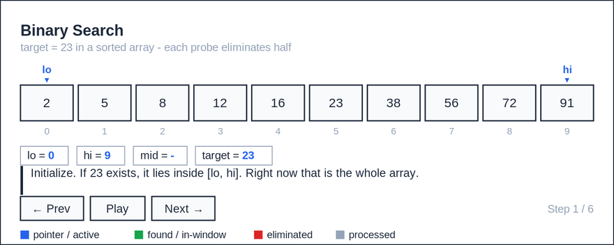
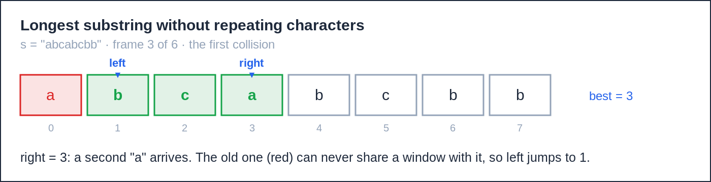
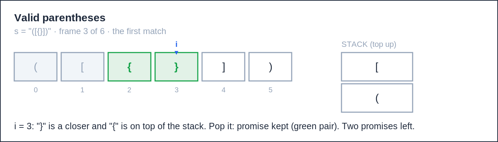
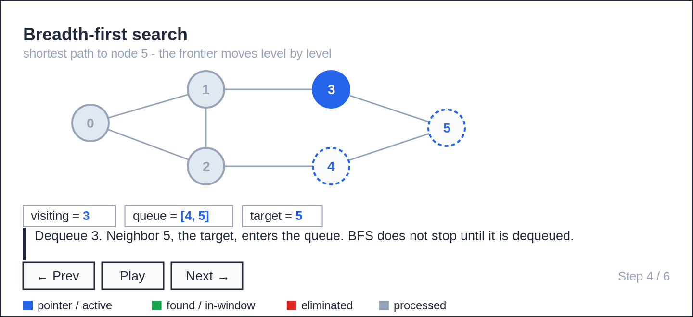

# algotrace

A Claude skill that teaches data structures and algorithms by drawing every step.


Most AI assistants take your almost-right solution and hand back a rewritten, fully correct one. You learn nothing. algotrace coaches by default, draws by default, and only gives complete code when you ask for it in plain words.

<picture>
  <source media="(prefers-color-scheme: dark)" srcset="assets/demo-dark.gif">
  
</picture>

Four colors, fixed meanings, nothing else: blue is the pointer, green is found, red is eliminated, gray is processed.

## Install

```bash
git clone https: https://github.com/swapnil5053/algotrace.git
```

Open a Claude Code session and just talk to it — no commands, no setup:

```text
visualize binary search for 23 in [2, 5, 8, 12, 16, 23, 38, 56, 72, 91]
debug this: [your broken code] fails on [1,2,3,4,10], expected 14 got 7
I'm stuck on longest substring without repeating characters. do not spoil it.
```

Claude.ai users: upload `SKILL.md`, `modes/`, and `assets/style-contract.md` to a project's knowledge base and add "Follow SKILL.md" to its instructions.

## Modes

| Say this | Mode | Get this |
|---|---|---|
| "visualize binary search on [2,5,8,...]" | visualize | Frame-by-frame trace, inline or as an interactive step player |
| "explain monotonic stack" | tutor | Definition, intuition, small trace, pitfalls, one check question |
| "I'm stuck on LC 3, don't spoil it" | hint | Five levels — observation → pattern → invariant → technique → skeleton — one per message |
| paste code + "why does this fail?" | debug | The exact bug, proven with a trace to where your code diverges |
| "just give me the full code in Java" | solution | Clean, commented code with complexity — only on explicit ask |
| "mock interview me, medium, 45 min" | interview | Timed phases, hints that cost points, a scored rubric |
| "review day" | review | Spaced-repetition drills from your progress log, plus a weakness report |

Say "say it simply" anytime to drop the jargon — same frames, one plain-English analogy per term.

Debug mode is the core of this skill. It proves the bug with a trace, then the fix is one line:

```diff
-    for i in range(k, len(nums) - 1):
+    for i in range(k, len(nums)):
```

## More traces

`visualize longest substring without repeating characters on "abcabcbb"`

<picture>
  <source media="(prefers-color-scheme: dark)" srcset="assets/screenshots/session-lc3-dark.png">
  
</picture>

`visualize valid parentheses on "([{}])"`

<picture>
  <source media="(prefers-color-scheme: dark)" srcset="assets/screenshots/session-lc20-dark.png">
  
</picture>

## Step players

Full walkthroughs compile into a single self-contained HTML file: prev/next/play, keyboard nav, playback speed, light/dark theme. Three ship in the repo:
`assets/visualizer-template.html` (binary search), `demos/sliding-window.html`, `demos/bfs-graph.html`.

<picture>
  <source media="(prefers-color-scheme: dark)" srcset="assets/screenshots/bfs-graph-dark.png">
  
</picture>

## What's in the repo

```
algotrace/
├── SKILL.md                       # router + format contract
├── modes/                         # the seven modes
├── assets/style-contract.md       # the four-color visual spec
├── docs/
│   ├── patterns-cheatsheet.md     # ten patterns: signal, template, complexity
│   ├── constraints-to-complexity.md
│   ├── jargon-decoder.md
│   └── study-plan.md              # eight-week prep plan mapped to modes
├── scripts/testgen.py             # edge-case input generator
├── examples/                      # sample debug + hint transcripts
└── .algotrace/progress.md         # created on first use, drives spaced repetition
```

## Comparison

vs. [algo-sensei](https://github.com/karanb192/algo-sensei), [peppermint leetcode-skill](https://github.com/peppermint-ai-lab/leetcode-skill), [LeetCode Teacher](https://github.com/luqmannurhakimbazman/ashford) — July 2026.

| | algotrace | algo-sensei | peppermint | LeetCode Teacher |
|---|---|---|---|---|
| Visualization | core, contractual | roadmap | ASCII, sometimes | none |
| Debug your own code | dedicated mode + proof trace | code review | post-submission feedback | none |
| Progress + spaced repetition | log, drills, weakness report | roadmap | tracking only | profile only |
| Test input generator | yes, unit tested | roadmap | no | no |
| Enforced visual style | strict contract file | no | no | no |

Peppermint generates original problems and researches company-specific questions; Algotrace drills you on problems you bring. Use both if the problem with supply is your bottleneck.

## FAQ

**Why not just prompt Claude directly?** You can, and it drifts. The skill pins the behavior: one router, one format contract, guardrails that hold over long sessions.

**Will it refuse to give me the answer?** No — solution mode is one sentence away. It just won't hand it over while you're still asking for a hint.

Python, Java, C++, and JavaScript are first-class throughout.


MIT licensed.
