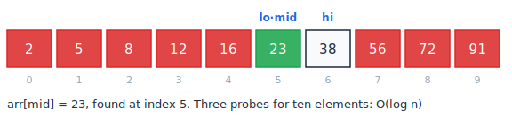

# algotrace

A Claude skill that teaches data structures and algorithms by drawing every step.


I built this because every AI assistant I tried during placement prep did the same thing: I'd paste a solution with one wrong loop bound, and instead of telling me where I went wrong, it would hand me a rewritten, fully correct solution. I'd read it, nod, and learn nothing. algotrace is the opposite. It coaches by default, it draws by default, and it only gives you complete code when you say, in plain words, that you want it.

Every trace it produces looks like this, whether inline in chat or in an interactive step player:



Four colors with fixed meanings. Blue is the pointer, green is found or in-window, red is eliminated, gray is processed. Nothing else, by contract.

## The first five minutes

```bash
git clone https://github.com/swapnil5053/algotrace- ~/.claude/skills/algotrace
```

Open a new Claude Code session and paste any of these:

```text
visualize binary search for 23 in [2, 5, 8, 12, 16, 23, 38, 56, 72, 91]
debug this: [your broken code] fails on [1,2,3,4,10], expected 14 got 7
I'm stuck on longest substring without repeating characters. do not spoil it.
```

No commands, no setup. The skill routes on intent.

## The seven modes

| You say | Mode | What you get |
|---|---|---|
| "visualize binary search on [2,5,8,...]" | visualize | A frame-by-frame trace, inline or as an interactive step player |
| "explain monotonic stack, I don't get it" | tutor | Definition, intuition, a mandatory small trace, pitfalls, one check question |
| "I'm stuck on LC 3, don't spoil it" | hint | A five-level ladder: observation, pattern, invariant, technique, skeleton. One level per message |
| paste code + "why does this fail?" | debug | The specific bug, proven with a trace to the exact step where your code diverges |
| "just give me the full code in Java" | solution | Clean commented code with complexity analysis. Only fires on an explicit ask |
| "mock interview me, medium, 45 min" | interview | Timed phases, hints that cost points, a scored rubric at the end |
| "review day" or "what am I weak on" | review | Spaced-repetition recall drills from your progress log, plus a weakness report by pattern and bug class |

Debug mode is the reason this exists. Paste a broken sliding-window attempt and algotrace will not rewrite it. It traces your code on the failing input, shows you the window that never gets formed, and asks one question that leads you to the bug. Ask again and you get a one-line diff:

```diff
-    for i in range(k, len(nums) - 1):
+    for i in range(k, len(nums)):
```

One line. Not a rewrite. Your code stays yours.

## The step players

Full walkthroughs become a single self-contained HTML file with prev/next/play controls and keyboard navigation. Three demos are baked in and work offline with zero dependencies:

| Demo | Shows |
|---|---|
| `assets/visualizer-template.html` | Binary search: pointers, elimination, the O(log n) invariant |
| `demos/sliding-window.html` | Fixed-size window: slide-don't-recompute, and the exact frame where off-by-ones bite |
| `demos/bfs-graph.html` | BFS on a graph with SVG frames: frontier, queue state, why it finds shortest paths |

Open any of them in a browser. They render a static first frame even with JavaScript disabled, so previews never show a blank page.

## What else is in here

- `docs/patterns-cheatsheet.md` — the ten patterns that cover most OA problems: signal words, when to use, template shape, complexity.
- `docs/study-plan.md` — an eight-week placement prep plan where each week names the modes that do the work, and review day runs on the progress log.
- `scripts/testgen.py` — a stdlib-only generator for edge-case test inputs (arrays, strings, trees, graphs, intervals), for when your solution passes the samples but fails hidden tests. Tested: `python -m unittest discover -s scripts`.
- `examples/` — two abridged transcripts showing what a debug session and a hint ladder look like in practice.
- A progress log (`.algotrace/progress.md` in your own project, created on first use) that review mode reads to schedule redos at expanding intervals and to build your weakness report.

## How it compares

Feature comparison with the most visible alternatives, July 2026: [algo-sensei](https://github.com/karanb192/algo-sensei), [peppermint leetcode-skill](https://github.com/peppermint-ai-lab/leetcode-skill), and [LeetCode Teacher](https://github.com/luqmannurhakimbazman/ashford).

| | algotrace | algo-sensei | peppermint | LeetCode Teacher |
|---|---|---|---|---|
| Visualization | core feature: inline traces plus interactive step players | none (open roadmap item) | ASCII "when helpful" | none |
| Debug your own code | dedicated mode: locates the bug, proves it with a trace, one-line diff | code review after solving | feedback after submission | none |
| Solution dumping | blocked by default, explicit escape hatch | discouraged | you write, it evaluates | discouraged |
| Progress tracking | progress log plus weakness report | roadmap item | yes, per pattern | learner profile |
| Spaced repetition | review mode, expanding intervals | roadmap item | no | retest suggestions |
| Test input generator | scripts/testgen.py, unit tested | roadmap item | no | no |
| Study plan | 8 weeks, mapped to modes | no | dashboard | no |
| Enforced visual style | strict contract file | no | no | no |

Two design choices explain the table. First, visualization here is not a feature bolted on; every mode is contractually required to ship a trace, which is why debug and review can prove things (a bug, a failed recall) instead of asserting them. Second, everything runs on plain Markdown and one HTML template: no runtime, no install scripts, nothing that breaks when Claude updates.

What the others do better: peppermint generates original CodeSignal-style multi-part problems and researches company-specific questions; this skill drills you on real problems you bring to it. If your bottleneck is problem supply rather than understanding, use both.

## Install elsewhere

Claude.ai or Claude desktop: create a project, upload `SKILL.md`, the `modes/` files, `assets/style-contract.md`, `assets/visualizer-template.html` and `docs/patterns-cheatsheet.md` to project knowledge, and add one line to the project instructions: "Follow SKILL.md: route messages to the matching mode file and obey assets/style-contract.md."

The mode files are self-contained prompts, so they also work pasted into any assistant that reads Markdown, at reduced fidelity.

## Questions people actually ask

**Why not just prompt Claude directly?** You can, and it drifts: one day you get a wall of text, the next a full solution you didn't want. The skill pins the behavior — the router picks one mode, the contract pins the format, the guardrails survive long conversations.

**Which languages?** Python, Java, C++ and JavaScript are first-class: idiomatic snippets, per-language bug checklists, overflow notes. Anything else works at pseudocode fidelity.

**Does it need anything installed?** No. Markdown files plus one dependency-free HTML template. `testgen.py` needs any Python 3.

**Will it refuse to give me answers?** No. Solution mode is one sentence away, always. It just will not hand you the answer while you are still asking for a hint.

## Repo layout

```text
algotrace/
├── SKILL.md                       entry point: triggers and intent router
├── modes/                         seven mode files, one per behavior
├── assets/
│   ├── style-contract.md          the formatting and color rules every mode follows
│   ├── visualizer-template.html   interactive step player, binary search baked in
│   └── readme-trace.svg           the figure above
├── demos/
│   ├── sliding-window.html        fixed-size window, max sum
│   └── bfs-graph.html             BFS with SVG graph frames
├── docs/
│   ├── patterns-cheatsheet.md     ten patterns with templates
│   └── study-plan.md              eight-week prep plan
├── examples/                      sample session transcripts
├── scripts/
│   ├── testgen.py                 edge-case input generator
│   └── test_testgen.py            its unit tests
├── .github/ISSUE_TEMPLATE/        wrong-trace and new-demo templates
├── CONTRIBUTING.md
└── LICENSE
```

## Contributing

See [CONTRIBUTING.md](CONTRIBUTING.md). The most useful contributions are new worked examples in the mode files and new baked demos. A wrong cell in a frame counts as a bug; there is an issue template for exactly that.

## License

MIT. See [LICENSE](LICENSE).
